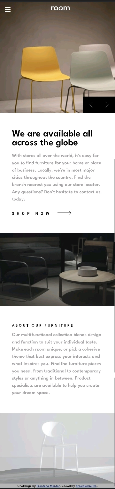

# Frontend Mentor - Room homepage solution

This is a solution to the [Room homepage challenge on Frontend Mentor](https://www.frontendmentor.io/challenges/room-homepage-BtdBY_ENq).

## Table of contents

- [Overview](#overview)
  - [The challenge](#the-challenge)
  - [Screenshot](#screenshot)
  - [Links](#links)
- [My process](#my-process)
  - [Built with](#built-with)
  - [What I learned](#what-i-learned)
  - [Useful resources](#useful-resources)
- [Author](#author)
- [Acknowledgments](#acknowledgments)

## Overview

### The challenge

Users should be able to:

- View the optimal layout for the site depending on their device's screen size
- See hover states for all interactive elements on the page
- Navigate the slider using their mouse/trackpad

### Screenshots

#### Desktop Version

  
  
  

#### Mobile Version

  
  
  

#### Active States

##### In desktop

  

##### In mobile

  

### Links

- [Solution URL](https://github.com/sree-lakshmi-n/room-homepage)
- [Live Site URL](https://sree-lakshmi-n.github.io/room-homepage/)

## My process

### Built with

- Semantic HTML5 markup
- CSS custom properties
- Flexbox
- CSS Grid
- Mobile-first workflow

### What I learned

- Mobile first web development
- Hamburger menu design
- Overlay
- Slideshow effect using JS
- Layout using flex

### Useful resources

- [Stack Overflow](https://stackoverflow.com/)
- [CSS Tricks Flexbox](https://css-tricks.com/snippets/css/a-guide-to-flexbox/)
- [Hamburger icon animations](https://codepen.io/designcouch/pen/ExvwPY)
- [Overlay styling](https://www.w3schools.com/howto/howto_css_overlay.asp)

## Author

- Frontend Mentor - [@sreelakshmin](https://www.frontendmentor.io/profile/sree-lakshmi-n)

## Acknowledgments

- My mentor
- Front end mentor for the challenge ides
- MDN documentation, W3Schools, css-tricks, stack-overflow
- Jonas Schmedtmann Udemy Course
